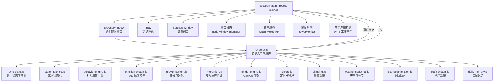
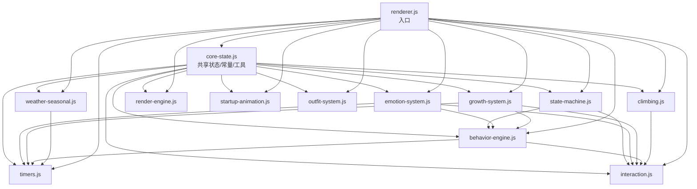

# 🏗️ 技术架构

> 本文档介绍 Yoyo 桌面宠物的整体技术架构，包含 ES Module 模块结构、进程模型、通信机制和共享状态管理。

## 目录

- [整体架构图](#整体架构图)
- [ES Module 模块结构](#es-module-模块结构)
- [模块间依赖关系](#模块间依赖关系)
- [共享状态管理](#共享状态管理)
- [主进程职责](#主进程mainjs职责)
- [渲染进程职责](#渲染进程模块体系)
- [IPC 通信通道列表](#ipc-通信通道列表)
- [事件通信机制](#事件通信机制)
- [文件结构说明](#文件结构说明)

---

## 整体架构图



## ES Module 模块结构

项目渲染进程采用 ES Module 拆分为职责单一的模块：

```
src/modules/
├── core-state.js        — 共享状态与常量（所有模块的基础层，不 import 其他模块）
├── state-machine.js     — 三层状态机引擎（globalMode → actionState → effects）
├── emotion-system.js    — PAD 情感模型 + 大五人格参数
├── growth-system.js     — 成长等级 / 签到 / 成就 / 进化路线 / 记忆系统
├── behavior-engine.js   — BEHAVIORS 注册表 + tick 逻辑 + 冷却 + 评分流水线
├── interaction.js       — 拖拽 / 喂食 / 鞭打三段反应 / 抚摸呼噜
├── climbing.js          — 攀爬系统（接近→攀爬→趴着→探头→下降）
├── weather-seasonal.js  — 天气获取 + 季节粒子特效
├── timers.js            — 定时器统一编排（提醒/天气/记忆/情感衰减）
├── outfit-system.js     — 换装系统（配饰/表情叠加绘制）
├── render-engine.js     — Canvas 渲染引擎 + 辫子弹簧物理
├── startup-animation.js — 旋转飞入启动动画
├── relationship-system.js — 关系阶段与亲密度
├── companion-planner.js — 每日陪伴计划
├── daily-memory.js     — 每日记忆卡片
├── news-broadcast.js   — 资讯播报
├── behavior-debug-panel.js — 行为调试面板
└── debug-log.js        — 调试日志桥接
```

入口文件 `renderer.js` 负责 import 所有模块并按序初始化。

## 主进程模块结构

`src/main.js` 现在只负责启动和模块装配，主进程能力拆到 `src/main/`：

```
src/main/
├── app-windows.js  — 主窗口、设置窗口、窗口 IPC
├── store.js        — 统一文件 Store、迁移、store IPC
├── pets.js         — 宠物扫描、导入、当前素材路径、多 sheet / look 快照
├── tray-menu.js    — 托盘与右键菜单
├── effects.js      — 飘落、分身、巨大化特效窗口
├── system.js       — 键盘监听、窗口扫描、繁忙检测、前台应用检测
├── weather.js      — 定位和天气
├── ai-lines.js     — DeepSeek 台词增强
├── news.js         — 新闻和热搜抓取
├── updater.js      — 自动更新
├── debug-log.js    — 主进程调试日志
└── env.js          — .env 加载
```

## 素材运行时结构

基础宠物使用 `sheets.base` 指向主 `spritesheet.webp`。新增动作和完整套装可以拆成独立 sheet：

```json
"sheets": {
  "base": "spritesheet.webp",
  "work": "actions/work.webp"
},
"states": {
  "idle": { "row": 0, "frames": 6 },
  "coffeeBreak": { "sheet": "work", "row": 0, "frames": 8 }
},
"looks": {
  "default": { "name": "默认", "spritesheetPath": "spritesheet.webp" },
  "warm": { "name": "暖暖套装", "spritesheetPath": "looks/warm/spritesheet.webp" }
}
```

运行时规则：

- 未声明 `sheet` 的状态从主图裁帧。
- 声明 `sheet` 或 `sheetPath` 的状态从独立动作图裁帧。
- 大型外观变化走完整 look sheet。
- 运行时不再支持旧 layer 换装。

## 模块间依赖关系



**依赖规则**：
- `core-state.js` 是最底层模块，不 import 任何其他模块，所有模块都依赖它
- `state-machine.js` 独立于 core-state，提供状态转换能力
- 上层模块（behavior-engine、interaction、timers）可以互相引用，但避免循环依赖
- `renderer.js` 作为入口，import 所有模块并编排初始化顺序

## 共享状态管理

采用**单一对象引用**模式，通过 `core-state.js` 导出的 `state` 对象实现跨模块状态共享：

- **`state` 对象**：包含所有可变运行时状态（当前宠物、模式标志、设置等），各模块通过 import 获得同一引用
- **`reactionState` 对象**：交互反应专用状态（抚摸阶段、鞭打阶段、喂食动画等）
- **`braidPhysics` 对象**：辫子物理参数（弹簧质点、刚度、阻尼等）
- **`petNeeds` 对象**：四维需求值（定义在 behavior-engine.js 中）
- **`StateMachine` 实例**：全局唯一实例 `stateMachine`，管理三层状态 + 锁

**持久化**使用 `localStorage`，各子系统独立管理自己的存储键：

| 存储键 | 管理模块 | 内容 |
|--------|----------|------|
| `yoyo_memory` | growth-system.js | 记忆数据（交互历史、活跃时段） |
| `yoyo_growth` | growth-system.js | 成长数据（XP、等级、进化路线） |
| `yoyo_checkin` | growth-system.js | 签到数据（连续天数、最后签到日） |
| `yoyo_achievements` | growth-system.js | 成就徽章解锁记录 |
| `yoyo_muted` | core-state.js | 静音状态 |

## 主进程（main.js）职责

主进程是 Electron 应用的核心，负责系统级操作：

| 模块 | 职责 |
|------|------|
| **窗口管理** | 创建 200×260 透明置顶窗口，处理拖拽移动、位置设置 |
| **系统托盘** | 创建托盘图标，右键菜单（显示/隐藏/导入/退出） |
| **宠物管理** | 扫描 `userData/pets/` 目录，读取 `pet.json`，管理多宠物切换 |
| **设置系统** | 持久化设置到 `yoyo-settings.json`，管理开机自启 |
| **窗口扫描** | 通过 node-window-manager 或 macOS CGWindowList 扫描桌面窗口 |
| **天气服务** | IP 定位 + Open-Meteo API 获取实时天气 |
| **繁忙检测** | 通过 `powerMonitor.getSystemIdleTime()` 检测连续工作，60分钟触发提醒 |
| **前台应用检测** | 每30秒检测前台窗口，识别 WPS 等工作应用 |
| **特效窗口** | 创建全屏透明窗口播放飘落特效（花瓣/糖果/爱心/巨大化/分身） |
| **右键菜单** | 动态构建右键菜单（抚摸/鞭打/跳舞/跟随/睡觉/切换宠物/设置） |

### 关键配置

```javascript
// 窗口尺寸
const APP_WIDTH = 200;
const APP_HEIGHT = 260;

// 窗口属性
{
  frame: false,          // 无边框
  transparent: true,     // 透明背景
  alwaysOnTop: true,     // 始终置顶
  resizable: false,      // 不可调整大小
  skipTaskbar: false,    // 显示在任务栏
}
```

## 渲染进程模块体系

渲染进程承载 Yoyo 的全部"灵魂"，拆分为多个 ES Module：

| 模块 | 职责 |
|------|------|
| **core-state.js** | 共享状态、常量、DOM引用、音频合成、SpeechQueue 文案队列 |
| **state-machine.js** | 三层状态机（globalMode/actionState/effects）、互斥组、统一锁管理 |
| **behavior-engine.js** | BEHAVIORS 注册表、每2秒 tick、评分流水线（utility→emotion→growth） |
| **emotion-system.js** | PAD 三维空间 + 大五人格，情感事件驱动，每5秒衰减回基线 |
| **growth-system.js** | 5级成长路线 + 3条进化路线 + 签到连击 + 成就徽章 + 记忆系统 |
| **interaction.js** | 拖拽物理、喂食星星眼、鞭打三段反应、抚摸呼噜、键盘响应 |
| **climbing.js** | 爬屏幕边缘/其他窗口，多阶段动画（接近→攀爬→趴着→探头→下降） |
| **weather-seasonal.js** | 天气获取 + 季节粒子 + playfulness 目标值计算 |
| **timers.js** | 统一定时器编排：延迟启动、错开周期、天气即时触发 |
| **render-engine.js** | Canvas 逐帧渲染 + 辫子弹簧物理 + 交互反应叠加绘制 |
| **startup-animation.js** | 旋转飞入动画（3圈旋转 + easeOut + 拖尾粒子） |
| **outfit-system.js** | look 套装切换 |
| **relationship-system.js** | 关系阶段与亲密度 |
| **companion-planner.js** | 每日陪伴计划 |
| **daily-memory.js** | 每日记忆卡片 |
| **news-broadcast.js** | 资讯播报 |

## IPC 通信通道列表

### 渲染进程 → 主进程（invoke/handle）

| 通道名 | 用途 | 返回值 |
|--------|------|--------|
| `pets:list` | 获取所有可用宠物列表 | `Pet[]` |
| `pet:import` | 导入新宠物素材 | `{ ok, pet?, pets?, error? }` |
| `pet:setPosition` | 设置窗口绝对位置 | `Bounds` |
| `pet:getPosition` | 获取窗口当前位置 | `Bounds` |
| `window:get-bounds` | 获取窗口和工作区边界 | `{ bounds, workArea }` |
| `window:move-by` | 相对移动窗口 | `Bounds` |
| `window:set-ignore-mouse` | 设置鼠标穿透 | `void` |
| `mouse:getPosition` | 获取鼠标屏幕坐标 | `{ x, y }` |
| `windows:scan` | 扫描桌面窗口（攀爬用） | `{ ok, hasAccessibility, windows }` |
| `weather:get` | 获取天气数据 | `{ ok, place?, current?, error? }` |
| `context-menu:show` | 弹出右键菜单 | `void` |
| `effect:fullscreen` | 触发全屏飘落特效 | `void` |
| `settings:load` | 加载设置 | `Settings` |
| `settings:save` | 保存设置 | `void` |
| `settings:reset` | 重置数据 | `void` |

### 主进程 → 渲染进程（事件推送）

| 事件名 | 用途 |
|--------|------|
| `menu-action` | 菜单操作（切换宠物/导入） |
| `action:pet` | 抚摸 |
| `action:whip` | 鞭打 |
| `action:dance` | 切换跳舞 |
| `action:follow` | 切换跟随鼠标 |
| `action:sleep` | 切换睡觉 |
| `system:resume` | 系统恢复/解锁 |
| `system:busy-reminder` | 繁忙工作提醒 |
| `active-app-changed` | 前台应用变化 |
| `settings-changed` | 设置更新 |
| `settings-reset` | 数据重置 |

### 渲染进程 → 主进程（单向消息）

| 通道名 | 用途 |
|--------|------|
| `menu-state:sync` | 同步右键菜单 checkbox 状态 |

## 事件通信机制

模块间通信采用以下方式：

1. **直接函数调用**：模块 import 后直接调用导出函数（主要方式）
2. **共享状态读写**：通过 `state` / `reactionState` 对象的属性变更，在渲染循环中被其他模块读取
3. **IPC 双向通信**：渲染进程 ↔ 主进程之间通过 `preload.js` 暴露的 `petApi` 接口
4. **SpeechQueue 队列**：文案系统通过优先级队列统一调度显示

## 文件结构说明

```
codex-desktop-pet/
├── src/
│   ├── modules/          # ES Module 模块目录
│   │   ├── core-state.js
│   │   ├── state-machine.js
│   │   ├── emotion-system.js
│   │   ├── growth-system.js
│   │   ├── behavior-engine.js
│   │   ├── interaction.js
│   │   ├── climbing.js
│   │   ├── weather-seasonal.js
│   │   ├── timers.js
│   │   ├── outfit-system.js
│   │   ├── render-engine.js
│   │   ├── startup-animation.js
│   │   ├── relationship-system.js
│   │   ├── companion-planner.js
│   │   └── daily-memory.js
│   ├── renderer.js       # 模块入口
│   ├── main.js           # 主进程
│   ├── preload.js        # 预加载脚本
│   ├── index.html        # 主窗口页面（Canvas + 气泡 + 喂食按钮）
│   ├── styles.css        # 样式（动画、气泡、抖动效果）
│   ├── settings.html     # 设置窗口页面
│   ├── effect.html       # 全屏飘落特效页面
│   ├── pixi-effect-stage.html # PixiJS 分身术/法相天地舞台
│   └── pixi-effect-stage.js   # PixiJS 特效编排
├── assets/yoyo/     # 默认宠物素材
│   ├── pet.json          # 宠物配置清单
│   └── spritesheet.webp  # 精灵图（8列×N行，每帧 192×208）
├── scripts/
│   └── expand-spritesheet.js  # 精灵图扩展工具
├── .github/workflows/
│   └── build-windows.yml      # GitHub Actions 自动打包
├── package.json          # 项目配置与构建脚本
└── docs/                 # 你正在阅读的文档 :)
```

### 数据目录（运行时生成）

```
~/.config/codex-desktop-pet/   (macOS: ~/Library/Application Support/codex-desktop-pet/)
├── pets/                      # 用户宠物素材副本
│   └── yoyo/
│       ├── pet.json
│       └── spritesheet.webp
└── yoyo-settings.json         # 持久化设置
```

---

*架构就像 Yoyo 的家，每个房间都有自己的工作～*
