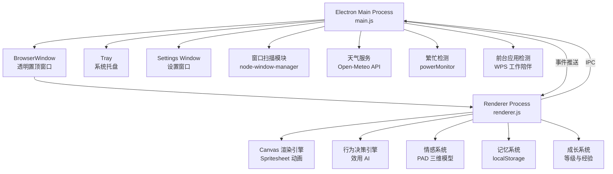

# 🏗️ 技术架构

> 本文档介绍 Yoyo 桌面宠物的整体技术架构，包含进程模型、通信机制和文件结构。

## 目录

- [整体架构图](#整体架构图)
- [主进程职责](#主进程mainjs职责)
- [渲染进程职责](#渲染进程rendererjs职责)
- [IPC 通信通道列表](#ipc-通信通道列表)
- [文件结构说明](#文件结构说明)

---

## 整体架构图



## 主进程（main.js）职责

主进程是 Electron 应用的核心，负责系统级操作：

| 模块 | 职责 |
|------|------|
| **窗口管理** | 创建 200×260 透明置顶窗口，处理拖拽移动、位置设置 |
| **系统托盘** | 创建托盘图标，右键菜单（显示/隐藏/导入/退出） |
| **宠物管理** | 扫描 `userData/pets/` 目录，读取 `pet.json`，管理多宠物切换 |
| **设置系统** | 持久化设置到 `yoyo-settings.json`，管理开机自启 |
| **窗口扫描** | 通过 node-window-manager 或 macOS CGWindowList 扫描桌面窗口 |
| **天气服务** | IP 定位 + Open-Meteo API 获取实时天气 |
| **繁忙检测** | 通过 `powerMonitor.getSystemIdleTime()` 检测连续工作，60分钟触发提醒 |
| **前台应用检测** | 每30秒检测前台窗口，识别 WPS 等工作应用 |
| **特效窗口** | 创建全屏透明窗口播放飘落特效（花瓣/糖果/爱心） |
| **右键菜单** | 动态构建右键菜单（抚摸/鞭打/跳舞/跟随/睡觉/切换宠物/设置） |

### 关键配置

```javascript
// 窗口尺寸
const APP_WIDTH = 200;
const APP_HEIGHT = 260;

// 窗口属性
{
  frame: false,          // 无边框
  transparent: true,     // 透明背景
  alwaysOnTop: true,     // 始终置顶
  resizable: false,      // 不可调整大小
  skipTaskbar: false,    // 显示在任务栏
}
```

## 渲染进程（renderer.js）职责

渲染进程承载 Yoyo 的全部"灵魂"，是核心逻辑所在：

| 模块 | 职责 |
|------|------|
| **Canvas 渲染** | 基于 spritesheet 的逐帧动画，192×208 每帧，0.75 缩放绘制 |
| **行为决策引擎** | 效用 AI，每2秒 tick，评估所有行为的 utility 选最高分执行 |
| **情感系统** | PAD 三维空间 + 大五人格，情感事件驱动，每5秒衰减回基线 |
| **记忆系统** | 记录交互历史（抚摸/喂食/鞭打），驱动记忆型问候和撒娇 |
| **成长系统** | 5级成长路线，经验值累积，升级影响行为阈值 |
| **攀爬系统** | 爬屏幕边缘/其他窗口，多阶段动画（接近→攀爬→趴着→探头→下降） |
| **交互系统** | 拖拽物理（重力下落+弹跳）、单击抚摸、右键菜单、喂食 |
| **提醒系统** | 定时喝水/吃饭提醒，特殊日期庆祝，里程碑检测 |
| **音效系统** | Web Audio API 合成音效（脚步/笑声/哭声/弹跳/拍手） |

## IPC 通信通道列表

### 渲染进程 → 主进程（invoke/handle）

| 通道名 | 用途 | 返回值 |
|--------|------|--------|
| `pets:list` | 获取所有可用宠物列表 | `Pet[]` |
| `pet:import` | 导入新宠物素材 | `{ ok, pet?, pets?, error? }` |
| `pet:setPosition` | 设置窗口绝对位置 | `Bounds` |
| `pet:getPosition` | 获取窗口当前位置 | `Bounds` |
| `window:get-bounds` | 获取窗口和工作区边界 | `{ bounds, workArea }` |
| `window:move-by` | 相对移动窗口 | `Bounds` |
| `window:set-ignore-mouse` | 设置鼠标穿透 | `void` |
| `mouse:getPosition` | 获取鼠标屏幕坐标 | `{ x, y }` |
| `windows:scan` | 扫描桌面窗口（攀爬用） | `{ ok, hasAccessibility, windows }` |
| `weather:get` | 获取天气数据 | `{ ok, place?, current?, error? }` |
| `context-menu:show` | 弹出右键菜单 | `void` |
| `effect:fullscreen` | 触发全屏飘落特效 | `void` |
| `settings:load` | 加载设置 | `Settings` |
| `settings:save` | 保存设置 | `void` |
| `settings:reset` | 重置数据 | `void` |

### 主进程 → 渲染进程（事件推送）

| 事件名 | 用途 |
|--------|------|
| `menu-action` | 菜单操作（切换宠物/导入） |
| `action:pet` | 抚摸 |
| `action:whip` | 鞭打 |
| `action:dance` | 切换跳舞 |
| `action:follow` | 切换跟随鼠标 |
| `action:sleep` | 切换睡觉 |
| `system:resume` | 系统恢复/解锁 |
| `system:busy-reminder` | 繁忙工作提醒 |
| `active-app-changed` | 前台应用变化 |
| `settings-changed` | 设置更新 |
| `settings-reset` | 数据重置 |

### 渲染进程 → 主进程（单向消息）

| 通道名 | 用途 |
|--------|------|
| `menu-state:sync` | 同步右键菜单 checkbox 状态 |

## 文件结构说明

```
codex-desktop-pet/
├── src/
│   ├── main.js          # 主进程：窗口管理、IPC、系统集成
│   ├── preload.js       # 预加载脚本：安全暴露 petApi 接口
│   ├── renderer.js      # 渲染进程：行为引擎、情感、记忆、成长、交互
│   ├── index.html       # 主窗口页面（Canvas + 气泡 + 喂食按钮）
│   ├── styles.css       # 样式（动画、气泡、抖动效果）
│   ├── settings.html    # 设置窗口页面
│   └── effect.html      # 全屏飘落特效页面
├── assets/xiao-hong/    # 默认宠物素材
│   ├── pet.json         # 宠物配置清单
│   └── spritesheet.webp # 精灵图（8列×N行，每帧 192×208）
├── scripts/
│   └── expand-spritesheet.js  # 精灵图扩展工具
├── .github/workflows/
│   └── build-windows.yml      # GitHub Actions 自动打包
├── package.json         # 项目配置与构建脚本
└── docs/                # 你正在阅读的文档 :)
```

### 数据目录（运行时生成）

```
~/.config/codex-desktop-pet/   (macOS: ~/Library/Application Support/codex-desktop-pet/)
├── pets/                      # 用户宠物素材副本
│   └── xiao-hong/
│       ├── pet.json
│       └── spritesheet.webp
└── yoyo-settings.json         # 持久化设置
```

---

*架构就像 Yoyo 的家，每个房间都有自己的工作～*
