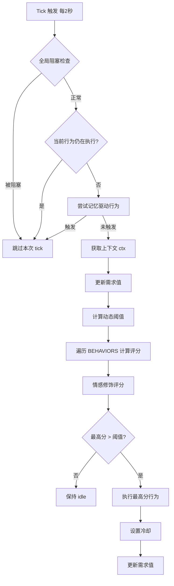

# 🧠 行为引擎详解

> Yoyo 的行为决策采用**效用 AI（Utility AI）**架构，每 2 秒进行一次决策 tick，从所有可用行为中选择效用分最高的执行。

## 目录

- [效用 AI 原理](#效用-ai-原理)
- [BEHAVIORS 数组结构](#behaviors-数组结构)
- [需求系统](#需求系统)
- [冷却机制](#冷却机制)
- [阈值与活跃度设置的关系](#阈值与活跃度设置的关系)
- [决策流程图](#决策流程图)
- [如何添加自定义行为](#如何添加自定义行为)

---

## 效用 AI 原理

传统状态机在行为多了以后容易变得难以维护。Yoyo 采用 **Utility AI** 模式：

1. **每 2 秒 tick 一次**：`setInterval(behaviorEngineTick, 2000)`
2. **遍历所有行为**：对 `BEHAVIORS` 数组中每个行为调用其 `utilityFn(needs, ctx)` 
3. **评分竞争**：选出分数最高的行为
4. **阈值过滤**：最高分必须超过动态阈值才会执行（否则保持 idle）
5. **情感修饰**：最终分数会经过 `applyEmotionModifier()` 调整
6. **执行行为**：调用 `onExecute()`，设置冷却，更新需求值



### 全局阻塞条件

当以下任何条件为 true 时，行为引擎跳过本次 tick：

- `isDancing` — 用户手动开启跳舞模式
- `isSleeping` — 用户手动开启睡眠模式
- `isFollowing` — 跟随鼠标模式
- `isWhipRunning` — 鞭打后逃跑中
- `feedingLock` — 正在执行喂食动画
- `dragState` — 正在被拖拽
- `isClimbing` — 正在攀爬中
- `isDropping` — 下落动画中

## BEHAVIORS 数组结构

每个行为是一个对象，结构如下：

```javascript
{
  name: 'walk',              // 行为唯一标识
  state: 'runningRight',     // 对应的动画状态
  duration: 4000,            // 行为持续时间（ms），期间不会被打断
  cooldown: 60000,           // 冷却时间（ms），执行后多久才能再次触发
  utilityFn(needs, ctx) {},  // 效用评分函数，返回 0-100
  onExecute() {},            // 执行逻辑
}
```

### 完整行为列表

| 行为名 | 动画状态 | 持续时间 | 冷却时间 | 简述 |
|--------|----------|----------|----------|------|
| `idle` | idle | 无限 | 0 | 兜底行为，需求都低时得分高 |
| `walk` | runningRight/Left | 4s | 60s | 散步移动窗口 |
| `wave` | waving | 3s | 120s | 挥手打招呼 |
| `dance` | dancing | 5s | 300s | 跳舞 |
| `sleep` | sleeping | 8s | 600s | 打盹（先打哈欠） |
| `climb` | climbing | 15s | 300s | 攀爬窗口/边缘 |
| `hungry` | waiting | 30s | 60s | 触发饥饿UI |
| `lookAround` | lookingAround | 5s | 180s | 东张西望 |
| `sweetTalk` | waving | 4s | 7200s | 撒娇表白 |
| `giftFlower` | gifting | 6s | 14400s | 送花 + 全屏特效 |
| `giftCandy` | gifting | 6s | 14400s | 送糖 + 全屏特效 |
| `swing` | swing | 6s | 3600s | 荡秋千 |
| `digSand` | digSand | 7s | 7200s | 挖土玩沙 |
| `readBook` | readBook | 8s | 10800s | 看书 |
| `watchTV` | watchTV | 8s | 7200s | 看电视 |
| `overtimeReminder` | waiting | 6s | 3600s | 加班心疼提醒 |
| `wpsCompanion` | review | 6s | 1800s | WPS 工作陪伴 |

## 需求系统

Yoyo 有 4 个维度的需求值，范围 0-100：

| 需求 | 初始值 | 每 tick 增长 | 说明 |
|------|--------|-------------|------|
| `energy` | 80 | +0.1（深夜 +0.25） | 越高越困，驱动 sleep 行为 |
| `boredom` | 20 | +0.05（闲置2分钟+ 额外 +0.05） | 越高越无聊，驱动 wave/walk/dance |
| `hunger` | 10 | +0.03 | 越高越饿，>70 触发 hungry 行为 |
| `playfulness` | 50 | 趋向天气目标值 | 好动度，晴天→70，雨天→30 |

### 需求值的自然变化

```javascript
// 每 2 秒 tick 一次
petNeeds.energy += 0.1;    // 慢慢变困
petNeeds.boredom += 0.05;  // 慢慢无聊
petNeeds.hunger += 0.03;   // 慢慢饿

// 天气影响 playfulness（缓动到目标值）
petNeeds.playfulness += (targetPlayfulness - petNeeds.playfulness) * 0.02;
```

### 行为如何消耗需求

| 行为 | 需求变化 |
|------|----------|
| walk | boredom -10, playfulness -5 |
| wave | boredom -8 |
| dance | boredom -25, energy +5 |
| sleep | energy -30 |
| climb | boredom -30 |
| lookAround | boredom -12 |
| swing | boredom -20, playfulness -10 |
| digSand | boredom -18 |
| readBook | boredom -15, energy +5 |
| watchTV | boredom -20 |

### 交互对需求的影响

| 交互 | 需求变化 |
|------|----------|
| 单击/抚摸 | boredom -15, playfulness +10 |
| 喂食 | hunger =10, boredom -20 |
| 鞭打 | energy -30 |

## 冷却机制

```javascript
const cooldowns = {}; // { behaviorName: endTimestamp }

function isOnCooldown(name) {
  if (!cooldowns[name]) return false;
  if (Date.now() >= cooldowns[name]) {
    delete cooldowns[name];
    return false;
  }
  return true;
}

function setCooldown(name, ms) {
  if (ms > 0) cooldowns[name] = Date.now() + ms;
}
```

- 行为执行后立即设置冷却
- 冷却期间该行为的评分直接跳过（不参与竞争）
- 特殊情况：喂食成功后会 `delete cooldowns['hungry']` 手动重置冷却

## 阈值与活跃度设置的关系

行为引擎有一个**动态阈值**，最高评分必须超过阈值才会执行：

```javascript
let threshold = 25; // 默认基础阈值

// 时间调节
if (ctx.hour >= 23 || ctx.hour < 6) threshold = 40;  // 深夜更安静
if (ctx.hour >= 8 && ctx.hour <= 10) threshold = 18;  // 上午更活泼

// 记忆调节：妈妈忙碌时段少打扰
if (isInBusyHour()) threshold += 10;

// 成长调节：等级越高越活泼
threshold -= (level - 1) * 2;

// 设置面板调节
if (activity === 'quiet') threshold += 15;   // 安静模式大幅提高阈值
if (activity === 'active') threshold -= 10;  // 活泼模式降低阈值
```

**阈值越高 = Yoyo 越安静，阈值越低 = Yoyo 越活泼**

| 活跃度设置 | 阈值调整 | 效果 |
|-----------|----------|------|
| 安静 | +15 | 很少主动行动，适合需要安静工作的场景 |
| 正常 | 0 | 默认行为频率 |
| 活泼 | -10 | 更频繁地走动、跳舞、说话 |

## 如何添加自定义行为

### 第 1 步：在 STATES 中注册动画状态（如果需要新动画）

```javascript
// renderer.js 顶部 STATES 对象
const STATES = {
  // ... 已有状态
  myNewState: { row: 26, frames: 8, speed: 200 },  // 新动画行
};
```

### 第 2 步：在 BEHAVIORS 数组中添加行为

```javascript
// 在 BEHAVIORS 数组末尾追加
{
  name: 'myBehavior',        // 唯一标识
  state: 'myNewState',       // 对应动画状态
  duration: 5000,            // 持续 5 秒
  cooldown: 1800000,         // 30 分钟冷却
  
  utilityFn(needs, ctx) {
    let score = 0;
    
    // 基于需求计算评分
    score += needs.boredom * 0.5;
    
    // 环境加权
    if (ctx.isWeekend) score += 10;
    if (ctx.hour >= 23 || ctx.hour < 6) score -= 30; // 深夜不触发
    
    return Math.max(0, Math.min(100, score));
  },
  
  onExecute() {
    setState('myNewState');
    say('Yoyo的新行为台词！');
    // 可选：触发情感事件
    applyEmotionEvent('happy');
  }
}
```

### 第 3 步：（可选）添加需求值消耗

在 `behaviorEngineTick` 函数的执行后逻辑中添加：

```javascript
} else if (bestBehavior.name === 'myBehavior') {
  petNeeds.boredom = Math.max(0, petNeeds.boredom - 15);
}
```

### 第 4 步：（可选）添加专用文案

```javascript
const MY_BEHAVIOR_LINES = [
  '文案1',
  '文案2',
  '文案3'
];
```

### utilityFn 编写指南

| 评分范围 | 含义 |
|----------|------|
| 0-15 | 几乎不会触发（除非阈值极低） |
| 15-30 | 偶尔触发（低频行为如撒娇、送花） |
| 30-50 | 中等频率 |
| 50-70 | 较高频率（条件满足时优先触发） |
| 70-100 | 高优先级（如饥饿度>70、加班提醒） |

### ctx 上下文对象字段

```javascript
{
  weather: Number,       // WMO 天气代码
  weatherKind: String,   // 'clear'|'cloudy'|'rain'|'snow'|'storm'|'fog'
  temp: Number,          // 温度（℃）
  hour: Number,          // 当前小时 0-23
  dayOfWeek: Number,     // 星期 0=周日
  isWeekend: Boolean,    // 是否周末
  isMonday: Boolean,     // 是否周一
  isSpecialDay: Boolean, // 是否纪念日
  idleTime: Number,      // 距上次交互的毫秒数
}
```

---

*Yoyo 的行为看似随机，其实每一步都是深思熟虑（2 秒的深思熟虑）的结果呢～*
