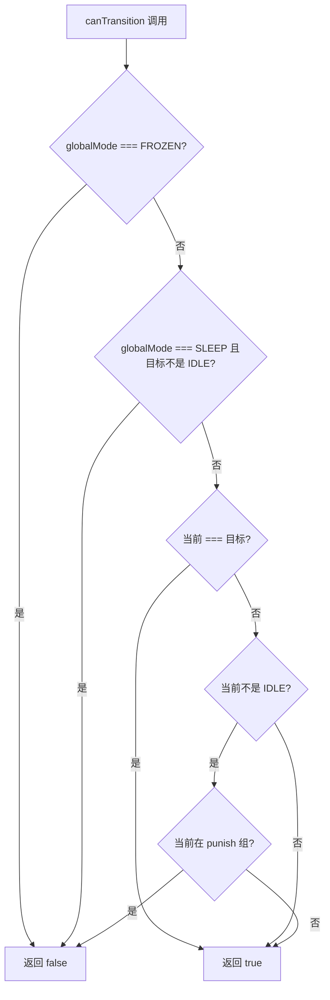
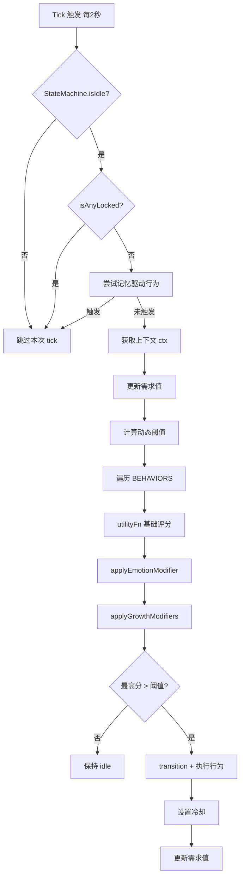

# 🧠 行为引擎详解

> Yoyo 的行为决策采用**三层 StateMachine + Utility AI** 架构。StateMachine 统一管理全局模式、行为状态和叠加特效；行为引擎每 2 秒 tick 一次，通过评分流水线从候选行为中选出最优执行。

## 目录

- [StateMachine 三层架构](#statemachine-三层架构)
- [互斥组定义](#互斥组定义)
- [canTransition 判断逻辑](#cantransition-判断逻辑)
- [统一锁管理](#统一锁管理)
- [评分流水线](#评分流水线)
- [BEHAVIORS 数组结构](#behaviors-数组结构)
- [需求系统](#需求系统)
- [冷却系统 + 菜单冷却同步](#冷却系统--菜单冷却同步)
- [定时器编排策略](#定时器编排策略)
- [阈值与活跃度设置的关系](#阈值与活跃度设置的关系)
- [决策流程图](#决策流程图)
- [如何添加自定义行为](#如何添加自定义行为)

---

## StateMachine 三层架构

StateMachine 将宠物的全部状态分为三个层次，自上而下依次收窄：

```
┌──────────────────────────────────────────────────┐
│  Layer 1: globalMode（全局模式）                    │
│    INTERACTIVE — 正常交互模式                       │
│    AUTO_PLAY   — 自动演出（行为引擎全权驱动）         │
│    SLEEP       — 睡眠模式（仅允许 → IDLE）           │
│    FROZEN      — 冻结模式（禁止一切转换）             │
│  ┌────────────────────────────────────────────┐   │
│  │  Layer 2: actionState（行为状态）             │   │
│  │    IDLE / WALKING / DANCING / CLIMBING /     │   │
│  │    FOLLOWING / FEEDING / DRAGGING /           │   │
│  │    TYPING_COMPANION / WHIP / DROPPING         │   │
│  │  ┌──────────────────────────────────────┐    │   │
│  │  │  Layer 3: effects（叠加特效，可多个）   │    │   │
│  │  │    EMOTION_BUBBLE — 情感气泡           │    │   │
│  │  │    SEASONAL_PARTICLES — 季节粒子       │    │   │
│  │  │    SCALE_ANIMATION — 缩放动画          │    │   │
│  │  │    CLONE_EFFECT — 分身术               │    │   │
│  │  └──────────────────────────────────────┘    │   │
│  └────────────────────────────────────────────┘   │
└──────────────────────────────────────────────────┘
```

**核心特点**：
- **Layer 1** 决定整体可用范围，`FROZEN` 时所有转换被拒绝
- **Layer 2** 在互斥组约束下切换，同一时刻只有一个 actionState
- **Layer 3** 采用 `Set` 结构，多个特效可同时叠加，独立于行为状态

## 互斥组定义

同一互斥组内的行为不能同时存在，当前 actionState 处于某组时，必须先回到 IDLE 才能切换到同组其他行为：

| 互斥组 | 包含的 actionState |
|--------|-------------------|
| **movement** | WALKING, CLIMBING, FOLLOWING |
| **interaction** | DRAGGING, FEEDING |
| **specialty** | DANCING, TYPING_COMPANION |
| **punish** | WHIP, DROPPING |

**punish 组特殊规则**：处于 punish 组时，拒绝一切转换（鞭打/下落不可被打断）。

## canTransition 判断逻辑

`canTransition(targetAction)` 的判断流程：



## 统一锁管理

StateMachine 内置 `locks` Map，替代了之前散落在各处的 boolean 标志位：

- **`acquireLock(name, duration)`**：获取锁，可选自动过期时长
- **`releaseLock(name)`**：手动释放锁
- **`isLocked(name)`**：检查锁状态（自动清理过期锁）
- **`isAnyLocked()`**：检查是否有任意锁存在

典型使用场景：
- 喂食动画期间获取 `feeding` 锁，防止行为引擎打断
- 鞭打反应期间获取 `whip` 锁，三段动画完整播放
- 拖拽期间获取 `dragging` 锁

## 评分流水线

每次 tick，行为引擎对每个候选行为执行三阶段评分：

```
utilityFn(needs, ctx)  →  applyEmotionModifier(name, score)  →  applyGrowthModifiers(score, name)
      ↑                           ↑                                      ↑
  基础效用评分                 情感系统修饰                          成长/进化修饰
  基于需求值+环境            PAD 情感维度调整                    等级解锁+路线偏好加成
```

### 第一阶段：utilityFn

每个行为自带的评分函数，基于当前需求值和环境上下文计算基础分（0-100）。

### 第二阶段：applyEmotionModifier

根据 PAD 情感空间的当前值修饰评分。例如：
- Pleasure 高时，跳舞/送花等行为加分
- Arousal 高时，活跃类行为加分
- Pleasure 低时，撒娇/哭泣类行为加分

### 第三阶段：applyGrowthModifiers

根据成长等级和进化路线修饰评分：
- **等级加成**：Lv.3+ 荡秋千×1.15、看书×1.1；Lv.5 送花×1.2
- **进化路线加成**：
  - 活力线：跳舞×1.2、走路×1.15
  - 温柔线：甜言蜜语×1.2、看书×1.15
  - 元气线：招手×1.2、WPS陪伴×1.15

最终选择评分最高且超过动态阈值的行为执行。

## BEHAVIORS 数组结构

每个行为是一个对象：

```javascript
{
  name: 'walk',              // 行为唯一标识
  state: 'runningRight',     // 对应的动画状态
  duration: 4000,            // 持续时间（ms），期间不会被打断
  cooldown: 60000,           // 冷却时间（ms）
  utilityFn(needs, ctx) {},  // 效用评分函数，返回 0-100
  onExecute() {},            // 执行逻辑
}
```

### 完整行为列表

| 行为名 | 动画状态 | 持续时间 | 冷却时间 | 简述 |
|--------|----------|----------|----------|------|
| `idle` | idle | 无限 | 0 | 兜底行为，需求都低时得分高 |
| `walk` | runningRight/Left | 4s | 60s | 散步移动窗口 |
| `wave` | waving | 3s | 120s | 挥手打招呼 |
| `dance` | dancing | 5s | 300s | 跳舞 |
| `sleep` | sleeping | 8s | 600s | 打盹（先打哈欠） |
| `climb` | climbing | 15s | 300s | 攀爬窗口/边缘 |
| `hungry` | waiting | 30s | 60s | 触发饥饿UI |
| `lookAround` | lookingAround | 5s | 180s | 东张西望 |
| `sweetTalk` | waving | 4s | 7200s | 撒娇表白 |
| `giftFlower` | gifting | 6s | 14400s | 送花 + 全屏特效 |
| `giftCandy` | gifting | 6s | 14400s | 送糖 + 全屏特效 |
| `swing` | swing | 6s | 3600s | 荡秋千 |
| `digSand` | digSand | 7s | 7200s | 挖土玩沙 |
| `readBook` | readBook | 8s | 10800s | 看书 |
| `watchTV` | watchTV | 8s | 7200s | 看电视 |
| `overtimeReminder` | waiting | 6s | 3600s | 加班心疼提醒 |
| `wpsCompanion` | review | 6s | 1800s | WPS 工作陪伴 |

## 需求系统

Yoyo 有 4 个维度的需求值，范围 0-100：

| 需求 | 初始值 | 每 tick 增长 | 说明 |
|------|--------|-------------|------|
| `energy` | 80 | +0.1（深夜 +0.25） | 越高越困，驱动 sleep 行为 |
| `boredom` | 20 | +0.05（闲置2分钟+ 额外 +0.05） | 越高越无聊，驱动 wave/walk/dance |
| `hunger` | 10 | +0.03 | 越高越饿，>70 触发 hungry 行为 |
| `playfulness` | 50 | 趋向天气目标值 | 好动度，晴天→70，雨天→30 |

**特殊状态暂停需求衰减**：当宠物处于 SLEEP / FROZEN 模式，或正在执行特殊交互（鞭打/喂食）时，需求值暂停自然增长。

### 行为如何消耗需求

| 行为 | 需求变化 |
|------|----------|
| walk | boredom -10, playfulness -5 |
| wave | boredom -8 |
| dance | boredom -25, energy +5 |
| sleep | energy -30 |
| climb | boredom -30 |
| lookAround | boredom -12 |
| swing | boredom -20, playfulness -10 |
| digSand | boredom -18 |
| readBook | boredom -15, energy +5 |
| watchTV | boredom -20 |

### 交互对需求的影响

| 交互 | 需求变化 |
|------|----------|
| 单击/抚摸 | boredom -15, playfulness +10 |
| 喂食 | hunger =10, boredom -20 |
| 鞭打 | energy -30 |

## 冷却系统 + 菜单冷却同步

### 行为冷却

- 行为执行后立即设置冷却计时
- 冷却期间该行为跳过评分（不参与竞争）
- 特殊情况：喂食成功后手动重置 `hungry` 冷却

### 菜单冷却同步

通过 `menu-state:sync` IPC 通道，将渲染进程的行为状态（跳舞/跟随/睡觉的开关）实时同步到主进程的右键菜单 checkbox 状态，保证用户看到的菜单与实际状态一致。

## 定时器编排策略

所有定时器通过 `timers.js` 统一管理，采用以下策略避免启动时的密集计算：

| 定时器 | 启动时机 | 周期 | 说明 |
|--------|----------|------|------|
| 每日提醒 | 立即 + 延迟5秒 | 60秒 | 检查喝水/吃饭/上下班提醒 |
| 天气刷新 | 延迟10秒 | 30分钟 | 避免与初始天气请求冲突 |
| 记忆系统 | 立即 | 65秒 | 每小时活跃度更新 + XP |
| 自动保存 | 立即 | 5分钟 | 定期持久化记忆数据 |
| 情感衰减 | 立即 | 5秒 | PAD 值缓慢衰减回基线 |
| 行为引擎 | 延迟启动 | 2秒 | 等待天气/记忆就绪后再 tick |

**天气即时触发**：天气数据更新后，`weather-seasonal.js` 会立即重新计算 `playfulness` 目标值并触发季节粒子检测，无需等待下一次 tick。

## 阈值与活跃度设置的关系

行为引擎有一个**动态阈值**，最高评分必须超过阈值才会执行：

- 默认基础阈值：25
- 深夜（23:00-6:00）：+15 → 更安静
- 上午（8:00-10:00）：-7 → 更活泼
- 妈妈忙碌时段：+10 → 少打扰
- 成长等级：每级 -2
- 设置面板：安静 +15 / 正常 0 / 活泼 -10

**阈值越高 = Yoyo 越安静，阈值越低 = Yoyo 越活泼**

## 决策流程图



## 如何添加自定义行为

### 第 1 步：在 STATES 中注册动画状态（如果需要新动画）

在 `core-state.js` 的 STATES 对象中添加：

```javascript
const STATES = {
  // ... 已有状态
  myNewState: { row: 26, frames: 8, speed: 200 },
};
```

### 第 2 步：在 BEHAVIORS 数组中添加行为

在 `behavior-engine.js` 的 BEHAVIORS 数组末尾追加：

```javascript
{
  name: 'myBehavior',
  state: 'myNewState',
  duration: 5000,
  cooldown: 1800000,
  
  utilityFn(needs, ctx) {
    let score = needs.boredom * 0.5;
    if (ctx.isWeekend) score += 10;
    if (ctx.hour >= 23 || ctx.hour < 6) score -= 30;
    return Math.max(0, Math.min(100, score));
  },
  
  onExecute() {
    setState('myNewState');
    say('Yoyo的新行为台词！');
    applyEmotionEvent('happy');
  }
}
```

### utilityFn 编写指南

| 评分范围 | 含义 |
|----------|------|
| 0-15 | 几乎不会触发（除非阈值极低） |
| 15-30 | 偶尔触发（低频行为如撒娇、送花） |
| 30-50 | 中等频率 |
| 50-70 | 较高频率（条件满足时优先触发） |
| 70-100 | 高优先级（如饥饿度>70、加班提醒） |

### ctx 上下文对象字段

```javascript
{
  weather: Number,       // WMO 天气代码
  weatherKind: String,   // 'clear'|'cloudy'|'rain'|'snow'|'storm'|'fog'
  temp: Number,          // 温度（℃）
  hour: Number,          // 当前小时 0-23
  dayOfWeek: Number,     // 星期 0=周日
  isWeekend: Boolean,    // 是否周末
  isMonday: Boolean,     // 是否周一
  isSpecialDay: Boolean, // 是否纪念日
  idleTime: Number,      // 距上次交互的毫秒数
}
```

---

*Yoyo 的行为看似随机，其实每一步都是深思熟虑（2 秒的深思熟虑）的结果呢～*
