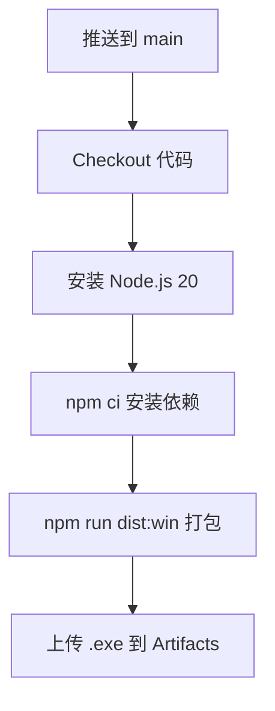

# 🚀 构建与部署

> 从开发环境搭建到生产包发布，一站式指南。

## 目录

- [开发环境搭建](#开发环境搭建)
- [本地运行](#本地运行)
- [Windows 打包](#windows-打包)
- [macOS 打包](#macos-打包)
- [GitHub Actions 工作流说明](#github-actions-工作流说明)
- [macOS 辅助功能权限说明](#macos-辅助功能权限说明)

---

## 开发环境搭建

### 前置要求

| 工具 | 版本要求 | 用途 |
|------|----------|------|
| Node.js | **20+** | 运行时环境 |
| npm | 随 Node.js 附带 | 包管理器 |
| Git | 任意版本 | 版本控制 |

### 安装步骤

```bash
# 1. 克隆仓库
git clone <your-repo-url>
cd codex-desktop-pet

# 2. 安装依赖
npm install
```

### 依赖说明

| 包名 | 类型 | 用途 |
|------|------|------|
| `electron` ^36.2.0 | devDependency | Electron 框架 |
| `electron-builder` ^26.0.12 | devDependency | 打包工具 |
| `sharp` ^0.34.5 | devDependency | 图片处理（精灵图扩展脚本用） |
| `node-window-manager` ^2.2.4 | dependency | 窗口扫描（攀爬功能） |

> 注意：`node-window-manager` 是原生模块，安装时需要编译环境（Windows 需要 Visual Studio Build Tools，macOS 需要 Xcode Command Line Tools）。

## 本地运行

```bash
npm start
```

这会直接启动 Electron 应用。Yoyo 会出现在屏幕右下角。

### 开发技巧

- **热重载**：Electron 没有自动热重载，修改代码后需要关闭重新 `npm start`
- **DevTools**：在代码中添加 `mainWindow.webContents.openDevTools()` 打开开发者工具
- **语法检查**：`npm run check` 快速检查 main.js / preload.js / renderer.js 语法

### 可用脚本

| 命令 | 说明 |
|------|------|
| `npm start` | 启动开发模式 |
| `npm run check` | 语法检查（node --check） |
| `npm run pack` | 打包为目录（不生成安装包，用于调试） |
| `npm run dist:win` | 打包 Windows NSIS 安装包 |

## Windows 打包

### 本地打包

```bash
npm run dist:win
```

产物在 `dist/` 目录下，生成 `CodexDesktopPetSetup-{version}.exe`。

### NSIS 安装包配置

```json
{
  "nsis": {
    "oneClick": false,                      // 非一键安装，显示安装向导
    "perMachine": false,                    // 用户级安装（无需管理员权限）
    "allowToChangeInstallationDirectory": true,  // 允许选择安装路径
    "createDesktopShortcut": true,          // 创建桌面快捷方式
    "createStartMenuShortcut": true,        // 创建开始菜单快捷方式
    "shortcutName": "Codex Desktop Pet"     // 快捷方式名称
  }
}
```

### 打包产物

```
dist/
├── CodexDesktopPetSetup-0.1.0.exe    # NSIS 安装包（~80MB）
├── win-unpacked/                      # 解压版目录
└── builder-effective-config.yaml      # 打包配置快照
```

## macOS 打包

### 本地打包（如果需要）

在 `package.json` 的 `scripts` 中添加：

```json
"dist:mac": "electron-builder --mac"
```

然后运行：

```bash
npm run dist:mac
```

> 注意：macOS 打包需要在 macOS 系统上执行。如果需要签名和公证，还需要 Apple Developer 证书。

### macOS 开发模式

macOS 用户通常直接用 `npm start` 运行开发版本即可，无需打包。

## GitHub Actions 工作流说明

项目配置了自动打包工作流 `.github/workflows/build-windows.yml`：

### 触发条件

```yaml
on:
  push:
    branches: [main]    # 推送到 main 分支自动触发
  workflow_dispatch:     # 支持手动触发
```

### 工作流步骤



### 具体配置

| 项 | 值 |
|----|-----|
| 运行环境 | `windows-latest` |
| Node.js 版本 | 20 |
| 缓存 | npm |
| 产物名称 | `YoyoDesktopPet-Windows` |
| 产物路径 | `dist/*.exe` |
| 保留天数 | 30 天 |

### 下载打包产物

1. 前往 GitHub 仓库 → Actions 页面
2. 点击最新的 workflow run
3. 滚动到底部 Artifacts 区域
4. 下载 `YoyoDesktopPet-Windows`

## macOS 辅助功能权限说明

### 为什么需要辅助功能权限？

Yoyo 的**窗口攀爬功能**需要扫描桌面上其他应用的窗口位置，这需要 macOS 辅助功能权限（Accessibility）。

### 权限检测逻辑

```javascript
// main.js 中的权限检测
let hasAccessibility = true;
if (process.platform === 'darwin') {
  hasAccessibility = systemPreferences.isTrustedAccessibilityClient(false);
}
```

### 授权步骤

1. 打开 **系统设置** → **隐私与安全性** → **辅助功能**
2. 点击锁图标解锁
3. 点击 **+** 添加应用
4. 选择 Yoyo 应用（开发模式下选择 Electron）
5. 确保开关打开

### 没有权限时会怎样？

- 攀爬功能会**自动降级**为仅支持屏幕边缘攀爬
- 不会扫描其他窗口，但 Yoyo 仍然可以爬到屏幕顶部/左右边缘探头
- 所有其他功能正常工作，不受影响

```javascript
// 降级逻辑
if (!hasAccessibility) {
  windows = scanWindowsViaMacOS(selfBounds);  // 使用 CGWindowList API
}
if (!windows) {
  // 仅支持屏幕边缘攀爬，不扫描窗口
}
```

### 常见问题

**Q: 每次更新应用后都要重新授权吗？**  
A: 如果应用签名变了（如开发版重新编译），可能需要。发布版签名固定则不需要。

**Q: 完全不授权可以用吗？**  
A: 可以！只是攀爬时不会爬到其他应用窗口上，其他功能完全正常。

---

*构建好的 Yoyo 就可以陪妈妈工作啦！打包发送给妈妈，让 Yoyo 住进妈妈的电脑里～*
