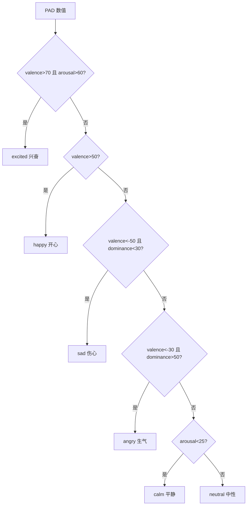

# 💗 情感系统

> Yoyo 的情感系统基于心理学的 **PAD 三维情感模型**和**大五人格理论**，让她拥有像真实小女孩一样丰富的情绪反应。

## 目录

- [PAD 三维模型](#pad-三维模型)
- [大五人格参数](#大五人格参数)
- [情感事件类型和触发](#情感事件类型和触发)
- [情感衰减机制](#情感衰减机制)
- [情感如何影响行为选择和文案](#情感如何影响行为选择和文案)

---

## PAD 三维模型

PAD 模型是心理学中描述情感状态的经典框架，由三个独立维度组成：

| 维度 | 英文 | 范围 | Yoyo 基线 | 含义 |
|------|------|------|-----------|------|
| **愉悦度** | Valence (P) | -100 ~ +100 | 55 | 正=开心，负=难过。Yoyo 天生偏开心 |
| **活跃度** | Arousal (A) | 0 ~ 100 | 55 | 高=兴奋/激动，低=平静/昏睡。Yoyo 天生活泼 |
| **掌控感** | Dominance (D) | 0 ~ 100 | 50 | 高=自信/掌控，低=无力/委屈 |

### 基线概念

Yoyo 的情绪会随时间**缓慢回归基线**（就像小孩子哭一会儿就忘了一样）：

```javascript
const yoyoEmotion = {
  valence: 55,        // 当前情绪值
  arousal: 55,
  dominance: 50,
  
  // 基线（情绪回归目标）
  baselineValence: 55,   // 偏开心的小女孩
  baselineArousal: 55,   // 活泼好动
  baselineDominance: 50, // 中等自信
};
```

### 情绪标签映射

系统会根据 PAD 值自动生成情绪标签，用于选择对应的文案：

```javascript
function getEmotionLabel() {
  if (valence > 70 && arousal > 60) return 'excited';  // 兴奋开心
  if (valence > 50) return 'happy';                     // 开心
  if (valence < -50 && dominance < 30) return 'sad';    // 伤心委屈
  if (valence < -30 && dominance > 50) return 'angry';  // 生气
  if (arousal < 25) return 'calm';                      // 平静
  return 'neutral';                                      // 中性
}
```



## 大五人格参数

Yoyo 的性格通过大五人格模型定义（0-100），这些参数会**调节情感事件的影响强度**：

| 人格维度 | 值 | 对 Yoyo 的意义 | 影响 |
|----------|-----|---------------|------|
| 外向性 (Extraversion) | 75 | 活泼外向，爱说话 | play 事件时 arousal 变化 ×1.25 |
| 宜人性 (Agreeableness) | 80 | 粘人温顺 | pet 时更开心（valence ×1.3），whip 时更无力 |
| 神经质 (Neuroticism) | 45 | 偶尔小脾气 | whip 时略微放大负面情绪 |
| 开放性 (Openness) | 70 | 好奇心强 | 对天气变化等新事物更感兴趣 |

### 性格调节公式

```javascript
function applyEmotionEvent(eventType) {
  const ev = EMOTION_EVENTS[eventType];
  let vMod = 1, aMod = 1, dMod = 1;

  if (eventType === 'pet') {
    vMod = 1 + (agreeableness - 50) / 100;  // 80 → 1.3倍
  } else if (eventType === 'whip') {
    vMod = 1 + (neuroticism - 50) / 100;    // 45 → 0.95倍
    dMod = 1 + (agreeableness - 50) / 100;  // 80 → 1.3倍（更无力）
  } else if (eventType === 'play') {
    aMod = 1 + (extraversion - 50) / 100;   // 75 → 1.25倍
  }

  valence = clamp(valence + ev.valence * vMod, -100, 100);
  arousal = clamp(arousal + ev.arousal * aMod, 0, 100);
  dominance = clamp(dominance + ev.dominance * dMod, 0, 100);
}
```

## 情感事件类型和触发

| 事件类型 | Valence | Arousal | Dominance | 触发时机 |
|----------|---------|---------|-----------|----------|
| `pet` | +30 | +20 | +10 | 单击抚摸、右键菜单"抚摸一下" |
| `whip` | -50 | +35 | -40 | 右键菜单"鞭打！" |
| `feed` | +40 | +10 | +5 | 喂食按钮点击 |
| `play` | +25 | +30 | +15 | 跳舞、荡秋千 |
| `ignore` | -10 | -5 | -5 | 超过5分钟未交互（每5分钟触发一次） |
| `happy` | +20 | +15 | +10 | 荡秋千、升级 |
| `curious` | +15 | +20 | +5 | 挖土 |
| `calm` | +10 | -20 | +5 | 看书、WPS陪伴 |
| `relaxed` | +15 | -15 | +5 | 看电视 |
| `worried` | -15 | +10 | -10 | 检测到妈妈加班 |
| `sad` | -30 | +20 | -15 | 哭泣动画 |

### 事件连锁示例

假设 Yoyo 被连续鞭打 5 次：

```
初始:  valence=55, arousal=55, dominance=50
第1次: valence=7.5, arousal=88, dominance=11  (whip: -50*0.95, +35, -40*1.3)
第2次: valence=-40, arousal=100, dominance=0   (继续下降)
第3次: valence=-87.5, arousal=100, dominance=0 (触底 clamp)
...
→ 情绪标签: 'sad'（valence<-50 且 dominance<30）
→ 触发哭泣动画和委屈文案
```

## 情感衰减机制

情感不会永远停留在极端值，而是**以每秒 1.5% 的速率向基线回归**：

```javascript
function updateEmotion(dt_ms) {
  const dt = dt_ms / 1000;
  const decay = 0.015; // 每秒 1.5%

  valence = lerp(valence, baselineValence, decay * dt);
  arousal = lerp(arousal, baselineArousal, decay * dt);
  dominance = lerp(dominance, baselineDominance, decay * dt);
}

// lerp: 线性插值
function lerp(a, b, t) { return a + (b - a) * Math.min(1, t); }
```

### 衰减定时器

```javascript
// 每 5 秒更新一次情感衰减
setInterval(() => updateEmotion(5000), 5000);
```

### 回归速度

| 时间 | 从极端值(-100)回归到基线(55)的进度 |
|------|-------------------------------------|
| 10秒 | ~14% → 约 -78 |
| 1分钟 | ~60% → 约 -7 |
| 2分钟 | ~84% → 约 30 |
| 5分钟 | ~99% → 约 53 |

> 大约 2-3 分钟就能从"大哭"恢复到正常心情，符合 4-5 岁小孩的情绪恢复速度 :)

## 情感如何影响行为选择和文案

### 对行为引擎评分的影响

`applyEmotionModifier(behaviorName, baseScore)` 会根据当前情绪调整行为评分：

| 行为 | 情绪条件 | 评分修饰 |
|------|----------|----------|
| `sweetTalk` | valence > 50 | ×1.3（开心更爱撒娇） |
| `sweetTalk` | valence < -30 | ×1.2（伤心求安慰） |
| `dance` | arousal > 70 | ×1.5（兴奋想跳舞） |
| `sleep` | arousal < 30 | ×1.4（平静想睡觉） |
| `climb` | dominance > 60 | ×1.3（自信想探险） |
| `walk` | arousal > 60 | ×1.2（活跃想动） |
| `wave` | valence < -20 | ×1.3（伤心想引起注意） |

### 对文案的影响

交互文案根据情绪标签分层选择：

```javascript
// 抚摸文案按情绪分类
const PET_DIALOGUES = {
  happy:   ['嘿嘿！妈妈摸摸！Yoyo最喜欢了～'],
  excited: ['哇！妈妈你好温柔！Yoyo爱你爱你爱你！'],
  neutral: ['嗯～妈妈的手好温暖'],
  calm:    ['嗯…妈妈摸摸…好舒服…'],
  sad:     ['…妈妈…你终于想起Yoyo了…'],
  angry:   ['…哼！（扭过头）'],
};
```

同一个"抚摸"动作，在不同情绪状态下 Yoyo 的反应完全不同：

- 😊 **开心时**被摸："嘿嘿！妈妈摸摸！Yoyo最喜欢了～"
- 😢 **伤心时**被摸："…妈妈…你终于想起Yoyo了…"
- 😠 **生气时**被摸："…哼！（扭过头）"

这让 Yoyo 的反应更像一个真实的、有情绪的小女孩。

---

*Yoyo 的心情就像天气，晴时开心雨时忧愁，但无论怎样，她都最爱妈妈～*
