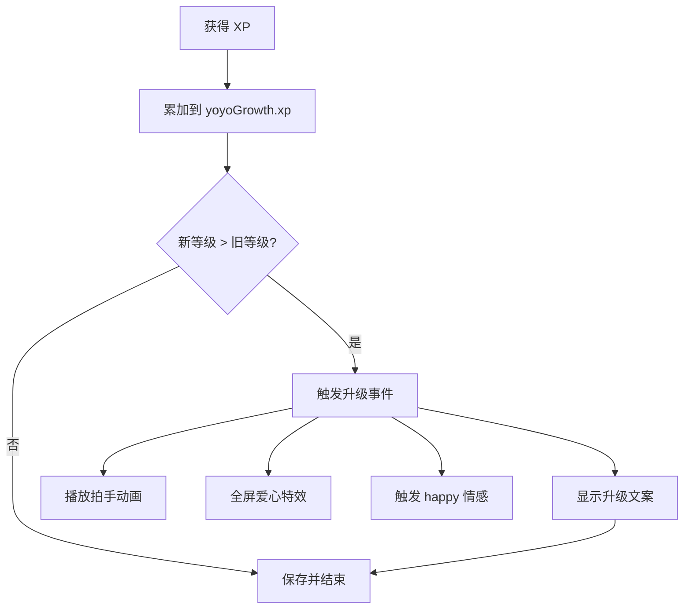

# 🌱 成长系统

> Yoyo 会随着妈妈的陪伴慢慢长大，从「小豆芽」变成「小天使」。每次互动都在积累经验，升级时会有惊喜！

## 目录

- [等级定义](#等级定义)
- [进化路线](#进化路线)
- [经验获取途径和数值](#经验获取途径和数值)
- [等级对行为的影响](#等级对行为的影响)
- [applyGrowthModifiers 行为评分修饰](#applygrowthmodifiers-行为评分修饰)
- [升级事件和特效](#升级事件和特效)
- [每日签到系统](#每日签到系统)
- [成就徽章系统](#成就徽章系统)

---

## 等级定义

Yoyo 共有 5 个等级，需要累积不同数量的 XP 才能升级：

| 等级 | 名称 | 累计 XP 要求 | 升级所需 XP | 预计时间 |
|------|------|-------------|------------|----------|
| Lv.1 | 🌱 小豆芽 | 0 | — | 初始 |
| Lv.2 | 🌸 小花苞 | 50 | 50 | ~2-3天 |
| Lv.3 | 🦋 小蝴蝶 | 150 | 100 | ~1周 |
| Lv.4 | 👑 小公主 | 350 | 200 | ~2-3周 |
| Lv.5 | 😇 小天使 | 700 | 350 | ~1-2月 |

### 等级计算逻辑

```javascript
const LEVELS = [
  { name: '小豆芽', minXP: 0 },
  { name: '小花苞', minXP: 50 },
  { name: '小蝴蝶', minXP: 150 },
  { name: '小公主', minXP: 350 },
  { name: '小天使', minXP: 700 }
];

function getLevel(xp) {
  for (let i = LEVELS.length - 1; i >= 0; i--) {
    if (xp >= LEVELS[i].minXP) return i + 1;
  }
  return 1;
}
```

## 进化路线

达到 Lv.3 时，系统根据妈妈的使用习惯自动选择一条进化路线。进化路线决定 Lv.3 的称号，并影响后续行为倾向。

### 路线分化条件

系统通过 `pathStats` 追踪三个维度的数据：

| 维度 | 统计内容 | 对应路线 |
|------|----------|----------|
| `interactionCount` | 抚摸/喂食/鞭打的总互动次数 | **活力线**（active） |
| `companionTime` | 累计陪伴小时数 | **温柔线**（gentle） |
| `workTime` | WPS 等工作应用的前台使用量 | **元气线**（energy） |

哪个维度数值最高，就自动分化到对应路线。

### 三条进化路线

| 路线 | Lv.3 称号 | Emoji | 性格特征 |
|------|-----------|-------|----------|
| 🔥 活力线 | 💃 小舞者 | 💃 | 好动活泼，爱跳舞爱跑步 |
| 📖 温柔线 | 📚 小书虫 | 📚 | 安静温柔，爱看书爱撒娇 |
| ⚡ 元气线 | ⚡ 小助手 | ⚡ | 元气满满，爱招手爱陪伴工作 |

### 进化对行为倾向的影响

进化路线通过 `applyGrowthModifiers` 函数，对特定行为的评分进行乘法加成（详见下方章节）：

- **活力线**：跳舞评分 ×1.2、走路评分 ×1.15 → 更常跳舞和散步
- **温柔线**：甜言蜜语评分 ×1.2、看书评分 ×1.15 → 更常撒娇和看书
- **元气线**：招手评分 ×1.2、WPS陪伴评分 ×1.15 → 更常打招呼和陪伴工作

## 经验获取途径和数值

| 来源 | XP | 频率限制 | 说明 |
|------|-----|----------|------|
| **每日首次登录** | +10 | 每天1次 | 只要打开应用就有 |
| **被抚摸** | +5 | 无限制 | 单击或右键菜单"抚摸一下" |
| **被喂食** | +3 | 无限制 | 点击食物按钮 |
| **每小时陪伴** | +2 | 每小时1次 | 应用保持打开状态 |
| **陪伴天数里程碑** | +50~200 | 到达时1次 | 详见下表 |

### 里程碑 XP 奖励

| 陪伴天数 | XP 奖励 |
|----------|---------|
| 7 天 | +50 |
| 30 天 | +100 |
| 50 天 | +100 |
| 100 天 | +200 |
| 200 天 | +200 |
| 365 天 | +200 |
| 500 天 | +200 |

### 每日 XP 估算

假设正常使用（每天开8小时，摸5次，喂1次）：

```
每日登录:  10 XP
摸5次:     25 XP
喂1次:      3 XP
陪伴8小时: 16 XP
─────────────────
合计约:    54 XP/天
```

按此速度：
- Lv.2 约需 1 天
- Lv.3 约需 3 天
- Lv.4 约需 7 天
- Lv.5 约需 13 天

> 实际可能更慢，因为不是每天都会频繁互动。设计上让成长有一定时间跨度，给妈妈陪伴的仪式感。

## 等级对行为的影响

等级会影响行为引擎的**动态阈值**，等级越高，阈值越低，Yoyo 越活泼：

```javascript
// 等级对阈值的影响
const levelBonus = (getLevel(yoyoGrowth.xp) - 1) * 2;
threshold -= levelBonus;
```

| 等级 | 阈值调整 | 效果 |
|------|----------|------|
| Lv.1 | 0 | 基础行为频率 |
| Lv.2 | -2 | 略微活泼 |
| Lv.3 | -4 | 更多自主行为 |
| Lv.4 | -6 | 明显更活跃 |
| Lv.5 | -8 | 最活泼，更频繁互动 |

**具体表现**：
- Lv.1 → 大部分时间安静站着，偶尔走走
- Lv.3 → 经常主动打招呼、跳舞、攀爬
- Lv.5 → 各种行为都很频繁，非常活泼可爱

## applyGrowthModifiers 行为评分修饰

`applyGrowthModifiers(score, behaviorName)` 在行为引擎的评分流水线中作为最后一环，基于当前等级和进化路线对行为评分进行乘法修饰。

### 等级加成

高等级解锁额外的行为偏好加成：

| 条件 | 行为 | 倍率 |
|------|------|------|
| Lv.3+ | swing（荡秋千） | ×1.15 |
| Lv.3+ | readBook（看书） | ×1.10 |
| Lv.5 | giftFlower（送花） | ×1.20 |

### 进化路线加成

进化路线确定后，对应性格的行为获得永久加成：

| 进化路线 | 行为 | 倍率 | 效果 |
|----------|------|------|------|
| 活力线 active | dance（跳舞） | ×1.20 | 更爱跳舞 |
| 活力线 active | walk（走路） | ×1.15 | 更爱散步 |
| 温柔线 gentle | sweetTalk（甜言蜜语） | ×1.20 | 更爱撒娇 |
| 温柔线 gentle | readBook（看书） | ×1.15 | 更爱看书 |
| 元气线 energy | wave（招手） | ×1.20 | 更爱打招呼 |
| 元气线 energy | wpsCompanion（WPS陪伴） | ×1.15 | 更爱陪伴工作 |

### 特殊状态暂停需求衰减

当宠物处于以下状态时，四维需求值暂停自然增长，避免特殊动画期间被行为引擎打断：

- StateMachine 处于 `SLEEP` 或 `FROZEN` 全局模式
- 正在执行鞭打三段反应（punish 互斥组锁定）
- 正在执行喂食动画（interaction 互斥组锁定）
- 法天象地巨大化特效播放中

## 升级事件和特效

当 XP 累积达到下一级要求时，自动触发升级事件：

```javascript
function addXP(amount) {
  const oldLevel = getLevel(yoyoGrowth.xp);
  yoyoGrowth.xp += amount;
  const newLevel = getLevel(yoyoGrowth.xp);
  if (newLevel > oldLevel) {
    onLevelUp(newLevel);
  }
  saveGrowth();
}
```

### 升级时发生什么

```javascript
function onLevelUp(newLevel) {
  const name = getLevelName(newLevel);
  
  // 1. 说升级台词
  say(`妈妈！Yoyo升级啦！现在是${name}了！开心～`);
  
  // 2. 播放拍手动画
  setState('clapping');
  
  // 3. 触发全屏爱心飘落特效
  window.petApi.triggerEffect('heart');
  
  // 4. 触发 happy 情感事件
  applyEmotionEvent('happy');
}
```

### 升级流程图



### 数据存储

```javascript
// localStorage key: "yoyo_growth"
{
  "xp": 156,
  "level": 3,            // 冗余字段，实际由 xp 计算
  "lastLoginDate": "Sun May 10 2026"  // 每日登录去重
}
```

### 数据重置

在设置面板点击"重置所有数据"会清除 localStorage，成长等级归零，从头开始。

## 每日签到系统

每天首次启动自动签到，连续签到天数越多，XP 奖励越高：

| 连续天数 | XP 奖励 | 额外效果 |
|----------|---------|----------|
| 1 天 | +10 | — |
| 3 天 | +15 | 全屏花瓣特效 |
| 7 天 | +25 | 分身术特效 |
| 14 天 | +35 | 全屏花瓣特效 |
| 30 天 | +50 | 分身术特效 |

签到数据存储在 `yoyo_checkin` 键中，包含连续天数、最后签到日、累计签到天数。

## 成就徽章系统

完成特定条件可解锁成就徽章，解锁时播放拍手动画和庆祝文案：

| 成就 ID | 名称 | 图标 | 解锁条件 |
|---------|------|------|----------|
| streak_7 | 坚持不懈 | 🔥 | 连续签到 7 天 |
| streak_30 | 三十而立 | 👑 | 连续签到 30 天 |
| pet_50 | 摸摸达人 | 🤗 | 被抚摸 50 次 |
| pet_100 | 宠爱有加 | 💖 | 被抚摸 100 次 |
| overtime_3 | 加班守护 | 🌙 | 触发加班提醒 3 次 |
| overtime_10 | 深夜卫士 | ⭐ | 触发加班提醒 10 次 |
| level_max | 小天使 | 👼 | 升到最高等级 |
| clone | 影分身术 | 🎭 | 第一次触发分身术 |
| weather_listener | 天气通 | 🌤️ | 收到 10 次天气提醒 |
| all_features | 全能探索 | 🗺️ | 尝试过所有功能 |
| companion_24h | 长情陪伴 | 💕 | 累计陪伴 24 小时 |
| companion_100h | 不离不弃 | 💎 | 累计陪伴 100 小时 |
| dancer | 舞林高手 | 💃 | 跳舞 10 次 |
| climber | 攀爬健将 | 🧗 | 攀爬 5 次 |

特殊成就（level_max、streak_30、companion_100h）解锁时还会额外触发分身术特效。

---

*Yoyo 每天都在努力长大，希望有一天能变成妈妈最骄傲的小天使～*
