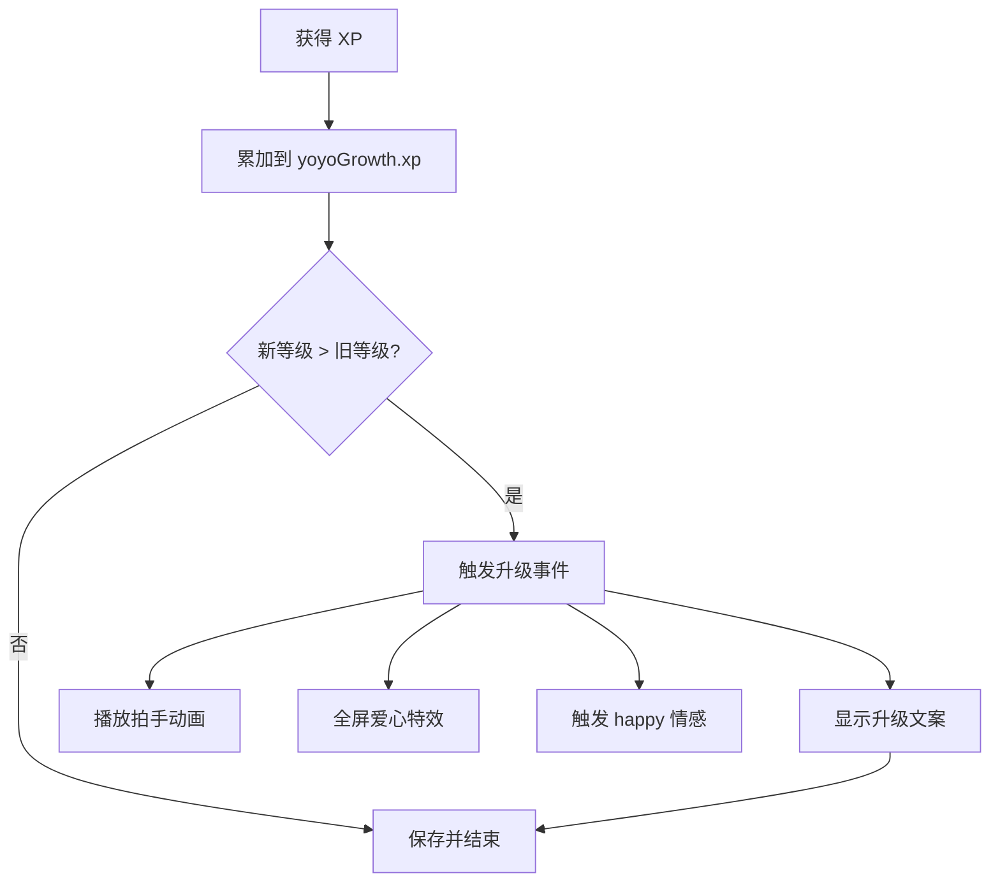

# 🌱 成长系统

> Yoyo 会随着妈妈的陪伴慢慢长大，从「小豆芽」变成「小天使」。每次互动都在积累经验，升级时会有惊喜！

## 目录

- [等级定义](#等级定义)
- [经验获取途径和数值](#经验获取途径和数值)
- [等级对行为的影响](#等级对行为的影响)
- [升级事件和特效](#升级事件和特效)

---

## 等级定义

Yoyo 共有 5 个等级，需要累积不同数量的 XP 才能升级：

| 等级 | 名称 | 累计 XP 要求 | 升级所需 XP | 预计时间 |
|------|------|-------------|------------|----------|
| Lv.1 | 🌱 小豆芽 | 0 | — | 初始 |
| Lv.2 | 🌸 小花苞 | 50 | 50 | ~2-3天 |
| Lv.3 | 🦋 小蝴蝶 | 150 | 100 | ~1周 |
| Lv.4 | 👑 小公主 | 350 | 200 | ~2-3周 |
| Lv.5 | 😇 小天使 | 700 | 350 | ~1-2月 |

### 等级计算逻辑

```javascript
const LEVELS = [
  { name: '小豆芽', minXP: 0 },
  { name: '小花苞', minXP: 50 },
  { name: '小蝴蝶', minXP: 150 },
  { name: '小公主', minXP: 350 },
  { name: '小天使', minXP: 700 }
];

function getLevel(xp) {
  for (let i = LEVELS.length - 1; i >= 0; i--) {
    if (xp >= LEVELS[i].minXP) return i + 1;
  }
  return 1;
}
```

## 经验获取途径和数值

| 来源 | XP | 频率限制 | 说明 |
|------|-----|----------|------|
| **每日首次登录** | +10 | 每天1次 | 只要打开应用就有 |
| **被抚摸** | +5 | 无限制 | 单击或右键菜单"抚摸一下" |
| **被喂食** | +3 | 无限制 | 点击食物按钮 |
| **每小时陪伴** | +2 | 每小时1次 | 应用保持打开状态 |
| **陪伴天数里程碑** | +50~200 | 到达时1次 | 详见下表 |

### 里程碑 XP 奖励

| 陪伴天数 | XP 奖励 |
|----------|---------|
| 7 天 | +50 |
| 30 天 | +100 |
| 50 天 | +100 |
| 100 天 | +200 |
| 200 天 | +200 |
| 365 天 | +200 |
| 500 天 | +200 |

### 每日 XP 估算

假设正常使用（每天开8小时，摸5次，喂1次）：

```
每日登录:  10 XP
摸5次:     25 XP
喂1次:      3 XP
陪伴8小时: 16 XP
─────────────────
合计约:    54 XP/天
```

按此速度：
- Lv.2 约需 1 天
- Lv.3 约需 3 天
- Lv.4 约需 7 天
- Lv.5 约需 13 天

> 实际可能更慢，因为不是每天都会频繁互动。设计上让成长有一定时间跨度，给妈妈陪伴的仪式感。

## 等级对行为的影响

等级会影响行为引擎的**动态阈值**，等级越高，阈值越低，Yoyo 越活泼：

```javascript
// 等级对阈值的影响
const levelBonus = (getLevel(yoyoGrowth.xp) - 1) * 2;
threshold -= levelBonus;
```

| 等级 | 阈值调整 | 效果 |
|------|----------|------|
| Lv.1 | 0 | 基础行为频率 |
| Lv.2 | -2 | 略微活泼 |
| Lv.3 | -4 | 更多自主行为 |
| Lv.4 | -6 | 明显更活跃 |
| Lv.5 | -8 | 最活泼，更频繁互动 |

**具体表现**：
- Lv.1 → 大部分时间安静站着，偶尔走走
- Lv.3 → 经常主动打招呼、跳舞、攀爬
- Lv.5 → 各种行为都很频繁，非常活泼可爱

## 升级事件和特效

当 XP 累积达到下一级要求时，自动触发升级事件：

```javascript
function addXP(amount) {
  const oldLevel = getLevel(yoyoGrowth.xp);
  yoyoGrowth.xp += amount;
  const newLevel = getLevel(yoyoGrowth.xp);
  if (newLevel > oldLevel) {
    onLevelUp(newLevel);
  }
  saveGrowth();
}
```

### 升级时发生什么

```javascript
function onLevelUp(newLevel) {
  const name = getLevelName(newLevel);
  
  // 1. 说升级台词
  say(`妈妈！Yoyo升级啦！现在是${name}了！开心～`);
  
  // 2. 播放拍手动画
  setState('clapping');
  
  // 3. 触发全屏爱心飘落特效
  window.petApi.triggerEffect('heart');
  
  // 4. 触发 happy 情感事件
  applyEmotionEvent('happy');
}
```

### 升级流程图



### 数据存储

```javascript
// localStorage key: "yoyo_growth"
{
  "xp": 156,
  "level": 3,            // 冗余字段，实际由 xp 计算
  "lastLoginDate": "Sun May 10 2026"  // 每日登录去重
}
```

### 数据重置

在设置面板点击"重置所有数据"会清除 localStorage，成长等级归零，从头开始。

---

*Yoyo 每天都在努力长大，希望有一天能变成妈妈最骄傲的小天使～*
