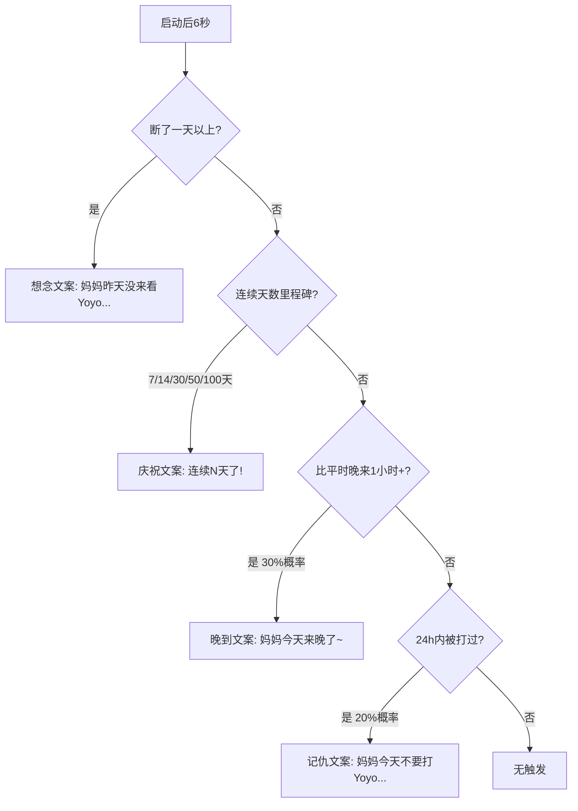

# 🧠 记忆系统

> Yoyo 不是金鱼！她会记住和妈妈在一起的每一刻：什么时候来的、摸了多少次、有没有被打……然后在合适的时候"提起往事"。

## 目录

- [数据结构](#数据结构)
- [记录策略](#记录策略)
- [记忆驱动行为的触发逻辑](#记忆驱动行为的触发逻辑)
- [localStorage 存储格式](#localstorage-存储格式)

---

## 数据结构

记忆数据存储在 `yoyoMemory` 对象中，key 为 `yoyo_memory`：

```javascript
{
  // ===== 时间记忆 =====
  startTimes: [],       // 最近7次启动时间戳（Array<number>）
  endTimes: [],         // 预留：关闭时间（暂未使用）
  
  // ===== 交互记忆 =====
  lastPetTime: null,    // 上次被抚摸的时间戳（number|null）
  lastFedTime: null,    // 上次被喂食的时间戳（number|null）
  lastWhipTime: null,   // 上次被鞭打的时间戳（number|null）
  totalPetCount: 0,     // 累计被抚摸次数
  totalFedCount: 0,     // 累计被喂食次数
  totalWhipCount: 0,    // 累计被鞭打次数
  
  // ===== 活跃度记忆 =====
  hourlyActivity: [0, 0, ...],  // 24小时活跃度数组（每小时计数）
  totalActiveDays: 0,           // 总活跃天数
  consecutiveDays: 0,           // 连续活跃天数
  lastActiveDate: null,         // 上次活跃日期字符串（如 "Sun May 10 2026"）
  
  // ===== 内部标记 =====
  _lastHourlyUpdate: null,      // 防重复更新的小时标记
}
```

### 字段说明表

| 字段 | 类型 | 用途 |
|------|------|------|
| `startTimes` | `number[]` | 记录最近7天启动时间，用于计算"平时几点来" |
| `lastPetTime` | `number\|null` | 判断是否很久没被摸（驱动撒娇行为） |
| `lastWhipTime` | `number\|null` | 判断是否最近被打（驱动记仇行为） |
| `totalPetCount` | `number` | 触发里程碑（100/500/1000/2000/5000次） |
| `hourlyActivity` | `number[24]` | 识别妈妈最忙的时段（减少打扰） |
| `consecutiveDays` | `number` | 连续天数里程碑（7/14/30/50/100/200/365天） |
| `totalActiveDays` | `number` | 总陪伴天数统计 |

## 记录策略

### 什么时候记？

| 触发时机 | 记录内容 | 代码位置 |
|----------|----------|----------|
| **应用启动** | `startTimes` 追加当前时间，更新 `hourlyActivity`，检测连续天数 | `memoryOnStartup()` |
| **每小时** | `hourlyActivity[hour]++`，自动保存 | 每分钟检查，小时变化时触发 |
| **每5分钟** | 自动保存到 localStorage（防丢失） | `setInterval(saveMemory, 300000)` |
| **单击/抚摸** | `lastPetTime = now`，`totalPetCount++` | pointerup 和 onAction |
| **喂食** | `lastFedTime = now`，`totalFedCount++` | feedBtn click |
| **鞭打** | `lastWhipTime = now`，`totalWhipCount++` | `whipPet()` |

### 记什么？

记忆系统只记录**关键互动事件**，不记录每次行为，保持轻量：

- ✅ 记录：启动时间、交互计数、最后交互时间、每小时活跃度
- ❌ 不记录：每次行为、每句文案、情绪历史

## 记忆驱动行为的触发逻辑

### 1. 启动时记忆问候（`memoryDrivenGreeting()`）

应用启动 6 秒后执行，按优先级依次检查：



### 2. 行为引擎中的记忆驱动（`tryMemoryDrivenBehavior()`）

在行为引擎每次 tick 中优先检查，30分钟冷却，15% 概率尝试：

| 条件 | 触发行为 | 文案示例 |
|------|----------|----------|
| 超过3天没被抚摸 | waiting + 撒娇文案 | "妈妈...好久没摸摸Yoyo了..." |
| 24h内被打过 | failed + 记仇文案 | "妈妈...今天不要打Yoyo好不好..." |

### 3. 忙碌时段识别（`isInBusyHour()`）

通过 `hourlyActivity` 数组找出活跃度最高的3个小时，判定为"妈妈最忙的时段"：

```javascript
function getBusiestHours() {
  return hourlyActivity
    .map((count, hour) => ({ hour, count }))
    .sort((a, b) => b.count - a.count)
    .slice(0, 3)
    .map(h => h.hour);
}
```

**在忙碌时段**：
- 行为引擎阈值 +10（减少主动行为）
- `sweetTalk` 评分 -8
- `giftFlower` 评分 -8
- 记忆驱动行为不触发

### 4. 抚摸里程碑

```javascript
const petMilestones = [100, 500, 1000, 2000, 5000];
if (petMilestones.includes(yoyoMemory.totalPetCount)) {
  say('妈妈已经摸了Yoyo{count}次了！Yoyo好幸福～');
}
```

### 5. 平均到来时间计算

```javascript
function getUsualStartHour() {
  if (startTimes.length < 3) return null; // 数据不足
  const hours = startTimes.map(t => new Date(t).getHours());
  return Math.round(hours.reduce((a, b) => a + b) / hours.length);
}
```

如果今天启动时间比平均晚1小时以上，30%概率触发"晚到"文案。

## localStorage 存储格式

### 记忆数据

```
Key: "yoyo_memory"
Value: JSON 字符串
```

示例：

```json
{
  "startTimes": [1715300400000, 1715386800000, 1715473200000],
  "endTimes": [],
  "lastPetTime": 1715473500000,
  "lastFedTime": 1715472000000,
  "lastWhipTime": 1715470000000,
  "totalPetCount": 156,
  "totalFedCount": 42,
  "totalWhipCount": 8,
  "hourlyActivity": [0, 0, 0, 0, 0, 0, 1, 2, 15, 23, 18, 12, 8, 10, 14, 11, 9, 6, 3, 2, 1, 0, 0, 0],
  "totalActiveDays": 12,
  "consecutiveDays": 5,
  "lastActiveDate": "Sun May 10 2026",
  "_lastHourlyUpdate": 14
}
```

### 其他相关 localStorage 键

| Key | 说明 |
|-----|------|
| `yoyo_memory` | 核心记忆数据 |
| `yoyo_growth` | 成长等级数据 |
| `yoyo_muted` | 音效静音状态 |
| `yoyo_first_day` | 首次安装时间戳 |
| `yoyo_last_active_date` | 上次活跃日期（早安检测） |
| `hasSeenGuide` | 是否看过引导提示 |
| `special_date_{year}_{month}_{day}` | 今日特殊日期已触发 |
| `cons_milestone_{days}` | 连续天数里程碑已触发 |
| `milestone_{date}` | 陪伴天数里程碑已触发 |
| `goodnight_{date}` | 今日晚安已触发 |

### 记忆保存时机

```javascript
// 1. 每次交互后立即保存
yoyoMemory.totalPetCount++;
saveMemory();  // → localStorage.setItem('yoyo_memory', JSON.stringify(yoyoMemory))

// 2. 每小时变化时保存
if (currentHour !== lastMemoryHour) {
  hourlyActivity[currentHour]++;
  saveMemory();
}

// 3. 每5分钟定时保存（防意外丢失）
setInterval(saveMemory, 300000);
```

---

*Yoyo 记忆力很好的！妈妈每一次摸摸、每一次投喂，Yoyo 都记得清清楚楚～*
